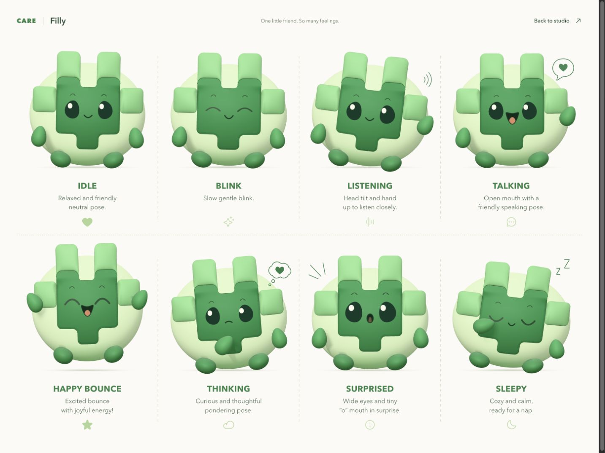

# @ohcnetwork/care-filly-character

> **Filly** — the CARE mascot as a real-time 3D web character. Built with three.js +
> react-three-fiber; drops into [`care_filly_fe`](https://github.com/ohcnetwork/care_filly_fe)
> (or any React app) as a component that idles, blinks, listens, talks, bounces, thinks,
> gets surprised, falls asleep — and follows the cursor, GitHub-Mona style.

[Playground](https://mascot.ohc.network/) · [All eight expressions](https://mascot.ohc.network/?sheet=1)

<p align="center">
  
</p>

The geometry is **procedural** and runs offline. The current sculpt follows the supplied
`reference/rebuild-target.png` character sheet: a pale rounded shell, a broad green face
with a cream crown notch, pillowy top and side tabs, emerald oval eyes, peach cheeks,
and small pear-shaped hands. The official CARE mark remains separately preserved in
`reference/care-logo-mark.svg`; the character is its expressive mascot adaptation.

The rebuilt cushions use welded, subdivided surfaces rather than flat box faces. Fine
clay grain, a recessed face seam, restrained eye reflections, and soft studio shadows
give the pieces depth. All eight expressions retain the existing animation and React API.
Look-and-feel constants live in `src/core/palette.ts`, `src/model/{geometry,limbs,face}.ts`,
and `src/animation/states.ts`.

---

## Local setup

```bash
git clone https://github.com/ohcnetwork/care_filly_character.git
cd care_filly_character
npm ci
npm run dev
```

Requires Node.js 22.9 or newer. The playground opens at `http://127.0.0.1:5178`.

To use the component from a sibling checkout, run `npm run build` here, then
`npm install ../care_filly_character` in the consuming app. The package name is
`@ohcnetwork/care-filly-character`; deploying the playground does not publish it to npm.

Peer deps: `react ≥ 18`, `react-dom ≥ 18`, `three ≥ 0.179`, `@react-three/fiber ≥ 9`.
(`three-bvh-csg` / `three-mesh-bvh`, used for the face-plate recess, are regular dependencies and install automatically.)

## Use

```tsx
import { FillyCharacter } from "@ohcnetwork/care-filly-character";

<FillyCharacter state="listening" size={160} />;
```

### `<FillyCharacter>` props

| Prop                                 | Type                                                                                     | Default       | What it does                                                                                              |
| ------------------------------------ | ---------------------------------------------------------------------------------------- | ------------- | --------------------------------------------------------------------------------------------------------- |
| `state`                              | `'idle' \| 'listening' \| 'talking' \| 'happy' \| 'thinking' \| 'surprised' \| 'sleepy'` | `'idle'`      | Animation state. Blink is automatic (and `ref.blink()`).                                                  |
| `audioLevel`                         | `number \| null`                                                                         | `null`        | 0..1 live level (mic/TTS). Drives the talking mouth and listening ear-wiggle; `null` = synthetic talking. |
| `size`                               | `number \| string`                                                                       | `160`         | Square size (px number or CSS size).                                                                      |
| `followPointer`                      | `boolean`                                                                                | `true`        | Eyes + head follow the pointer anywhere on the page (off in `sleepy`).                                    |
| `interactive`                        | `boolean`                                                                                | `true`        | Hover → attentive, press → squash, click → short happy bounce.                                            |
| `onClick`                            | `() => void`                                                                             | —             | Fired on click when `interactive`.                                                                        |
| `paused`                             | `boolean`                                                                                | `false`       | Freeze the animation (last pose stays). The loop also pauses automatically when the canvas is offscreen.  |
| `seed`                               | `number`                                                                                 | `1`           | PRNG seed for blink timing / idle glances (deterministic).                                                |
| `dpr`                                | `number \| [min, max]`                                                                   | `[1, 2]`      | Device pixel ratio cap.                                                                                   |
| `background`                         | `string`                                                                                 | `transparent` | Canvas CSS background.                                                                                    |
| `className`, `style`                 | —                                                                                        | —             | Applied to the wrapper `div` (inline-block).                                                              |
| `freezeAt`, `freezeBlink`, `onReady` | —                                                                                        | —             | Deterministic single frame (screenshots/tests).                                                           |

Ref handle: `{ blink(): void; setState(s): void; getAnimator(): FillyAnimator }`.

### `<FillyMascot>` — for care_filly_fe

Takes the plugin's `FillyStatus` instead of a raw state, so it can be wired straight to `useFilly()`:

```tsx
import { FillyMascot } from "@ohcnetwork/care-filly-character";

<FillyMascot
  status={filly.status}
  speaking={isAssistantSpeaking}
  audioLevel={level}
  size={96}
/>;
```

| `FillyStatus` | → state                                    |
| ------------- | ------------------------------------------ |
| `idle`        | `idle`                                     |
| `recording`   | `listening` (or `talking` when `speaking`) |
| `paused`      | `sleepy`                                   |
| `processing`  | `thinking`                                 |
| `completed`   | `happy`                                    |
| `failed`      | `surprised`                                |

### Integration sketch for `care_filly_fe/src/components/filly/FillyController.tsx`

```tsx
// Lazy-load so three.js + react-three-fiber (~250 kB gz) stay out of the plugin's initial chunk.
const FillyMascot = React.lazy(() =>
  import("@ohcnetwork/care-filly-character").then((m) => ({
    default: m.FillyMascot,
  })),
);

// The controller already computes `barHeights` from an AnalyserNode — reuse it:
const level =
  barHeights.reduce((a, b) => a + b, 0) / Math.max(1, barHeights.length);

<React.Suspense fallback={null}>
  <FillyMascot
    status={filly.status}
    audioLevel={level}
    size={96}
    onClick={handleStart}
  />
</React.Suspense>;
```

Because the package is ESM with `three`/`@react-three/fiber` as peers, it works inside the
module-federation remote like any other dependency (they are bundled into the remote; `react`
stays shared with the host).

### Without React

```ts
import * as THREE from "three";
import { FillyModel, FillyAnimator } from "@ohcnetwork/care-filly-character";

const model = new FillyModel(); // THREE.Group — add it to any scene
const animator = new FillyAnimator();
animator.setState("listening");
// per frame:
model.applyPose(animator.update(dt), animator.time);
```

`FillyModel` has the feet at `y = -1`; frame it with `FILLY_MODEL_BOUNDS` (exported), e.g.
a 16.2° camera at `(0, 0.22, 9)` looking at `(0, 0.085, 0)`. Set `scene.environment` to a
`RoomEnvironment` PMREM for the soft reflections; see `src/react/FillyScene.tsx` for the exact
light rig.

### Static `.glb`

`dist/filly-mascot.glb` (also exported as `@ohcnetwork/care-filly-character/filly-mascot.glb`)
is the idle-posed mesh with PBR materials — usable in Blender, `<model-viewer>`, Spline, etc.
Animation lives in code, not in the file. Regenerate with `npm run export:glb`.

---

## How it is put together

```
src/
├── core/        FillyPose (the per-frame parameter contract), FillyState, PALETTE, MATERIALS
├── model/       FillyModel — three.js rig: CSG body + plate, tiles, limbs, eyes, mouth, decorations
├── animation/   FillyAnimator — springs + per-state targets/loops, blink, talking, pointer follow
└── react/       <FillyCharacter> (Canvas, lights, env, frame loop), <FillyMascot>
playground/      dev page: interactive / ?state=&t= frames / ?sheet=1 / ?export=1
scripts/         harness.mts (vite + headless Chromium), snapshot.mts (screenshots),
                 export-glb.mts (.glb), singlefile.mts (one-file demo page)
docs/superpowers/specs/   design spec
```

- **Contract:** `FillyPose` is ~30 numbers (body squash/stretch, ear/arm angles, eye openness,
  gaze, mouth open/smile/round, cheek, decoration opacities). The animator produces one per
  frame; the model renders it. Both sides can be tested/replaced independently.
- **Animation:** critically/under-damped springs chase a per-state target pose; procedural loops
  (breathing, bounce, ear wiggle, gaze drift, syllable envelope) are layered on top; a seeded
  PRNG keeps everything deterministic for a given seed and `dt` sequence.
- **Rendering:** transparent canvas, `dpr ≤ 2`, hemisphere + key/fill/rim lights, procedural
  `RoomEnvironment`, `NeutralToneMapping`, a soft variance shadow map, and a separate contact-shadow plane.
- **Cost:** one-time CSG build ≈ 60–80 ms (cached module-wide); cached subdivided geometry per character;
  the library adds ≈ 45–60 kB gz to an app that already ships three + react-three-fiber
  (three + r3f themselves are ≈ 250 kB gz — load the character lazily).

## Development

```bash
npm install
npm run dev          # playground on http://127.0.0.1:5178
npm run check        # typecheck + lint + tests
npm run snapshot     # screenshots/*.png + sheet.png (headless Chromium)
npm run build        # dist/index.js + d.ts
npm run build:playground # dist-playground/ — static site for Cloudflare Pages
npm run export:glb   # dist/filly-mascot.glb
npm run build:all    # clean + build + export:glb
npm run build:demo   # dist-playground/filly-playground.html — the playground as ONE self-contained file
```

`snapshot`, `export:glb` and `build:demo` drive headless Chromium through Playwright; on a fresh
machine run `npx playwright install chromium` once. `prepublishOnly` runs `build:all`, so
publishing also needs Chromium available.

Playground URLs: `/` interactive · `/?state=happy&t=1.2` deterministic frame ·
`/?sheet=1` all states in the reference layout · `/?export=1` GLB export hook.

## Cloudflare Pages

The playground is a static Vite site deployed by the `care-filly-character` Pages
project. Cloudflare builds `ohcnetwork/care_filly_character` automatically on pushes
to `main`; GitHub Actions runs typechecking, linting, tests, and both builds.

| Setting | Value |
| --- | --- |
| Root directory | Repository root |
| Build command | `npm run build:playground` |
| Build output directory | `dist-playground` |
| Node.js version | 22 (from `.node-version`) |
| Custom domain | `mascot.ohc.network` |
| Pages hostname | `care-filly-character.pages.dev` |

For a local production build, run `npm ci && npm run build:playground`. Build output
is generated locally or by Cloudflare and is not committed to the repository. The
custom domain uses a Cloudflare-managed CNAME from `mascot` to
`care-filly-character.pages.dev`. The site needs no runtime secrets or server.

## License

MIT
