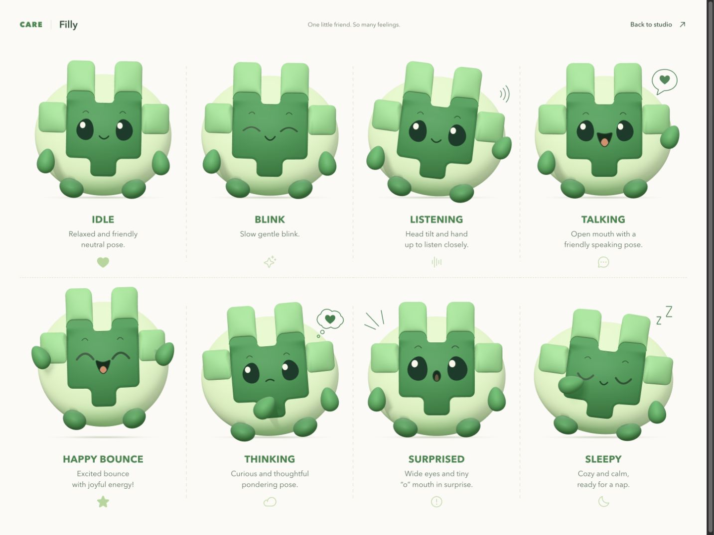

# @ohcnetwork/care-filly-character

> **Filly** — the CARE mascot as a real-time 3D web character. Built with three.js +
> react-three-fiber; drops into [`care_filly_fe`](https://github.com/ohcnetwork/care_filly_fe)
> (or any React app) as a component that idles, blinks, listens, talks, bounces, thinks,
> gets surprised, falls asleep — and follows the cursor, GitHub-Mona style.

[Playground](https://mascot.ohc.network/) · [All eight expressions](https://mascot.ohc.network/?sheet=1)

<p align="center">
  
</p>

The geometry is **procedural** and runs offline. The current sculpt follows the supplied
`reference/rebuild-target.png` character sheet: a pale rounded shell, a broad green face
with a cream crown notch, rounded upper horns and side ears, flat cartoon eyes,
and small pear-shaped hands. The official CARE mark remains separately preserved in
`reference/care-logo-mark.svg`; the character is its expressive mascot adaptation.

The rebuilt cushions use welded, subdivided surfaces rather than flat box faces. Fine
clay grain, a recessed face seam, simple ink eyes, and soft studio shadows
give the pieces depth. The horns and side ears share their borders with the face.
The horn roots stay attached while a two-bone rig bends their upper sections.
All eight expressions retain the existing animation and React API.
Look-and-feel constants live in `src/core/palette.ts`, `src/model/{crown,sideEar,geometry,limbs,face}.ts`,
and `src/animation/states.ts`.

---

## Local setup

```bash
git clone https://github.com/ohcnetwork/care_filly_character.git
cd care_filly_character
npm ci
npm run dev
```

Requires Node.js 22.9 or newer. The playground opens at `http://127.0.0.1:5178`.

To use the component from a sibling checkout, run `npm run build` here, then
`npm install ../care_filly_character` in the consuming app. The package name is
`@ohcnetwork/care-filly-character`; deploying the playground does not publish it to npm.

Peer deps: `react ≥ 18`, `react-dom ≥ 18`, `three ≥ 0.179`, `@react-three/fiber ≥ 9`.
(`three-bvh-csg` / `three-mesh-bvh`, used for the face-plate recess, are regular dependencies and install automatically.)

## Use

```tsx
import { FillyCharacter } from "@ohcnetwork/care-filly-character";

<FillyCharacter state="listening" size={160} />;
```

### `<FillyCharacter>` props

| Prop                                 | Type                                                                                     | Default       | What it does                                                                                              |
| ------------------------------------ | ---------------------------------------------------------------------------------------- | ------------- | --------------------------------------------------------------------------------------------------------- |
| `state`                              | `'idle' \| 'listening' \| 'talking' \| 'happy' \| 'thinking' \| 'surprised' \| 'sleepy'` | `'idle'`      | Animation state. Blink is automatic (and `ref.blink()`).                                                  |
| `audioLevel`                         | `number \| null`                                                                         | `null`        | 0..1 live level (mic/TTS). Drives the talking mouth and listening ear-wiggle; `null` = synthetic talking. |
| `size`                               | `number \| string`                                                                       | `160`         | Square size (px number or CSS size).                                                                      |
| `followPointer`                      | `boolean`                                                                                | `true`        | Eyes + head follow the pointer anywhere on the page (off in `sleepy`).                                    |
| `interactive`                        | `boolean`                                                                                | `true`        | Hover → attentive, press → squash, click → short happy bounce.                                            |
| `onClick`                            | `() => void`                                                                             | —             | Fired on click when `interactive`.                                                                        |
| `paused`                             | `boolean`                                                                                | `false`       | Freeze the animation (last pose stays). The loop also pauses automatically when the canvas is offscreen.  |
| `seed`                               | `number`                                                                                 | `1`           | PRNG seed for blink timing / idle glances (deterministic).                                                |
| `dpr`                                | `number \| [min, max]`                                                                   | `[1, 2]`      | Device pixel ratio cap.                                                                                   |
| `background`                         | `string`                                                                                 | `transparent` | Canvas CSS background.                                                                                    |
| `className`, `style`                 | —                                                                                        | —             | Applied to the wrapper `div` (inline-block).                                                              |
| `freezeAt`, `freezeBlink`, `freezeFrom`, `onReady` | —                                                                          | —             | Deterministic single frame (screenshots/tests). `freezeFrom` starts the frame's transition in that state. |

Ref handle: `{ blink(): void; setState(s): void; getAnimator(): FillyAnimator }`.

### `<FillyMascot>` — for care_filly_fe

Takes the plugin's `FillyStatus` instead of a raw state, so it can be wired straight to `useFilly()`:

```tsx
import { FillyMascot } from "@ohcnetwork/care-filly-character";

<FillyMascot
  status={filly.status}
  speaking={isAssistantSpeaking}
  audioLevel={level}
  size={96}
/>;
```

| `FillyStatus` | → state                                    |
| ------------- | ------------------------------------------ |
| `idle`        | `idle`                                     |
| `recording`   | `listening` (or `talking` when `speaking`) |
| `paused`      | `sleepy`                                   |
| `processing`  | `thinking`                                 |
| `completed`   | `happy`                                    |
| `failed`      | `surprised`                                |

### Integration sketch for `care_filly_fe/src/components/filly/FillyController.tsx`

```tsx
// Lazy-load so three.js + react-three-fiber (~250 kB gz) stay out of the plugin's initial chunk.
const FillyMascot = React.lazy(() =>
  import("@ohcnetwork/care-filly-character").then((m) => ({
    default: m.FillyMascot,
  })),
);

// The controller already computes `barHeights` from an AnalyserNode — reuse it:
const level =
  barHeights.reduce((a, b) => a + b, 0) / Math.max(1, barHeights.length);

<React.Suspense fallback={null}>
  <FillyMascot
    status={filly.status}
    audioLevel={level}
    size={96}
    onClick={handleStart}
  />
</React.Suspense>;
```

Because the package is ESM with `three`/`@react-three/fiber` as peers, it works inside the
module-federation remote like any other dependency (they are bundled into the remote; `react`
stays shared with the host).

### Without React

```ts
import * as THREE from "three";
import { FillyModel, FillyAnimator } from "@ohcnetwork/care-filly-character";

const model = new FillyModel(); // THREE.Group — add it to any scene
const animator = new FillyAnimator();
animator.setState("listening");
// per frame:
model.applyPose(animator.update(dt), animator.time);
```

`FillyModel` has the feet at `y = -1`; frame it with `FILLY_MODEL_BOUNDS` (exported), e.g.
a 16.2° camera at `(0, 0.22, 9)` looking at `(0, 0.085, 0)`. Set `scene.environment` to a
`RoomEnvironment` PMREM for the soft reflections; see `src/react/FillyScene.tsx` for the exact
light rig.

### Static `.glb`

`dist/filly-mascot.glb` (also exported as `@ohcnetwork/care-filly-character/filly-mascot.glb`)
is the idle-posed mesh with PBR materials — usable in Blender, `<model-viewer>`, Spline, etc.
Animation lives in code, not in the file. Regenerate with `npm run export:glb`.

### GitHub Universe 2025 badge (`badger/`)

Filly also runs on the GitHub Universe 2025 badge (Pimoroni Tufty 2350 with MonaOS,
[gh.io/badger](https://gh.io/badger)). The badge cannot run three.js, so `npm run export:badger`
renders the animation from the playground as sprite frames: one 8-bit paletted PNG per frame
(transparent index 0, the format of the badge's own Mona sprites), grouped in a directory per
state, plus `manifest.json`. Reaction clips start with the ease-in from idle (`freezeFrom`), then
a seamless loop.

```
badger/
├── filly/
│   ├── fillylib.py      shared library: palette, Clip (one frame in RAM), Filly (anchor + shadow), text helpers
│   └── assets/          manifest.json + <state>/NN.png frames (generated, 592 kB)
├── apps/
│   ├── filly-mascot/    A listen · B talk · C happy · UP think · DOWN sleep
│   ├── filly-pulse/     ECG rhythm game
│   └── filly-pet/       care companion with saved vitals
└── tools/simulate.py    headless test harness for the badge25 simulator
```

Each app has an `__init__.py` and a generated 24×24 `icon.png`. The 3 apps share one copy of the
frames through `fillylib`.

**Frame format.** One scale for every state: the idle body is 72 px tall (60 % of the 120 px
screen). Each state has its own crop box, so the idle body does not shrink to make room for the
happy bounce. The manifest gives each state `w`, `h` and an offset `ox`, `oy` from the anchor.
The anchor is the feet point: the bottom centre of the idle body. An app blits a frame at
`(anchor_x + ox, anchor_y + oy)`, and the feet stay on the same pixel in every state. `extent`
gives the farthest reach from the anchor over all states (45 px left and right, 85 px up).

**Memory.** The MicroPython heap on the badge is about 240 kB and fragmented (largest free block
about 48 kB), so no sprite sheet stays in RAM. `fillylib.Clip` decodes the frame on screen from
flash (about 20 ms and 8 kB for the largest 90×83 frame), like the MonaOS startup animation.

#### filly-mascot

Filly reacts to the buttons: A listen, B talk, C happy, UP think, DOWN sleep or wake. A press
while Filly sleeps gives a surprise. A reaction returns to idle after 3 s. The speech pill at the
top left shows what Filly says.

#### filly-pulse

Filly plays an ECG rhythm game. A spike moves along the monitor at the top of the screen. Press A
when the spike crosses the orange marker. A hit gives 1 point. A hit within 55 ms of the beat gives
3 points. Each hit adds 1 to the streak, and the streak makes the beat faster (60 to 150 BPM). A
miss costs 1 life. The round ends after 3 misses. Press B to pause or resume a round. The badge
saves the best score in the `filly-pulse` state.

#### filly-pet

Filly is a virtual CARE pet with 3 bars: REST, JOY and CARE. The bars go down with time. They also
go down between sessions, up to a limit of 8 h. Press A to hydrate Filly (CARE goes up). Press B to
play with Filly (JOY goes up, REST goes down). Press C to start a rest (REST goes up). Any button
wakes Filly. Press UP or DOWN to show the age and the care count. The badge saves the state in
`filly-pet` after each action, every 30 s, and on HOME.

**Install on the badge:**

1. Connect the badge over USB-C. Press RESET 2 times. The `BADGER` disk mounts (it is `/system`).
2. Copy `badger/filly` to `/Volumes/BADGER/filly`. Copy each app directory from `badger/apps/` to
   `/Volumes/BADGER/apps/`. Remove AppleDouble files: `dot_clean -m /Volumes/BADGER`.
3. The menu holds 6 apps. In `/Volumes/BADGER/apps/menu/__init__.py`, replace 3 entries with
   `("filly", "filly-mascot")`, `("filly pulse", "filly-pulse")` and `("filly pet", "filly-pet")`.
4. Eject the disk. Press RESET 1 time.

**Debug.** To see an app error, read the badge's USB serial port (`cat /dev/cu.usbmodem*`):
MicroPython prints the traceback there before the watchdog restarts the badge.

**Test without hardware.** `badger/tools/simulate.py` runs an app in the
[badge25 simulator](https://github.com/badger/home/tree/main/badge25/simulator) without a
window. It uses a virtual clock, presses buttons from a script, and saves screenshots and a
contact sheet. It needs Python 3.13 with pygame and a clone of `badger/home`:

```bash
BADGER_HOME=/path/to/badger-home python badger/tools/simulate.py filly-mascot \
  --seconds 12 --keys "a@1,b@4,c@7,up@10" --shots 0.5,2,5,8,11 --out /tmp/sim
```

The run ends with `OK:` (and the number of frame decodes) or `FAIL:` with the traceback.

---

## How it is put together

```
src/
├── core/        FillyPose (the per-frame parameter contract), FillyState, PALETTE, MATERIALS
├── model/       FillyModel — three.js rig: CSG body + plate, tiles, limbs, eyes, mouth, decorations
├── animation/   FillyAnimator — springs + per-state targets/loops, blink, talking, pointer follow
└── react/       <FillyCharacter> (Canvas, lights, env, frame loop), <FillyMascot>
playground/      dev page: interactive / ?state=&t=[&from=] frames / ?sheet=1 / ?export=1
scripts/         harness.mts (vite + headless Chromium), snapshot.mts (screenshots),
                 export-glb.mts (.glb), export-badger.mts (badge sprite frames), singlefile.mts (one-file demo page)
badger/          GitHub Universe 2025 badge: shared fillylib + frames, 3 apps, simulator harness
docs/superpowers/specs/   design spec
```

- **Contract:** `FillyPose` is ~30 numbers (body squash/stretch, ear/arm angles, eye openness,
  gaze, mouth open/smile/round, cheek, decoration opacities). The animator produces one per
  frame; the model renders it. Both sides can be tested/replaced independently.
- **Animation:** critically/under-damped springs chase a per-state target pose; procedural loops
  (breathing, bounce, ear wiggle, gaze drift, syllable envelope) are layered on top; a seeded
  PRNG keeps everything deterministic for a given seed and `dt` sequence.
- **Rendering:** transparent canvas, `dpr ≤ 2`, hemisphere + key/fill/rim lights, procedural
  `RoomEnvironment`, `NeutralToneMapping`, a soft variance shadow map, and a separate contact-shadow plane.
- **Cost:** one-time CSG build ≈ 60–80 ms (cached module-wide); cached subdivided geometry per character;
  the library adds ≈ 45–60 kB gz to an app that already ships three + react-three-fiber
  (three + r3f themselves are ≈ 250 kB gz — load the character lazily).

## Development

```bash
npm install
npm run dev          # playground on http://127.0.0.1:5178
npm run check        # typecheck + lint + tests
npm run snapshot     # screenshots/*.png + sheet.png (headless Chromium)
npm run build        # dist/index.js + d.ts
npm run build:playground # dist-playground/ — static site for Cloudflare Pages
npm run export:glb   # dist/filly-mascot.glb
npm run export:badger # badger/filly/assets/ + badger/apps/*/icon.png — sprite frames for the Universe 2025 badge (~10 min)
npm run build:all    # clean + build + export:glb
npm run build:demo   # dist-playground/filly-playground.html — the playground as ONE self-contained file
```

`snapshot`, `export:glb`, `export:badger` and `build:demo` drive headless Chromium through Playwright; on a fresh
machine run `npx playwright install chromium` once. `prepublishOnly` runs `build:all`, so
publishing also needs Chromium available.

Playground URLs: `/` interactive · `/?state=happy&t=1.2` deterministic frame ·
`/?state=happy&t=0.3&from=idle` frame on the idle → happy transition ·
`/?sheet=1` all states in the reference layout · `/?export=1` GLB export hook.

## Cloudflare Pages

The playground is a static Vite site deployed by the `care-filly-character` Pages
project. Cloudflare builds `ohcnetwork/care_filly_character` automatically on pushes
to `main`; GitHub Actions runs typechecking, linting, tests, and both builds.

| Setting | Value |
| --- | --- |
| Root directory | Repository root |
| Build command | `npm run build:playground` |
| Build output directory | `dist-playground` |
| Node.js version | 22 (from `.node-version`) |
| Custom domain | `mascot.ohc.network` |
| Pages hostname | `care-filly-character.pages.dev` |

For a local production build, run `npm ci && npm run build:playground`. Build output
is generated locally or by Cloudflare and is not committed to the repository. The
custom domain uses a Cloudflare-managed CNAME from `mascot` to
`care-filly-character.pages.dev`. The site needs no runtime secrets or server.

### Site metadata and sharing

The canonical URL is [mascot.ohc.network](https://mascot.ohc.network/). Metadata in
`playground/index.html` uses the static 1200 × 630 image `/og-filly.jpg` for link
previews. Its source artwork is the `/?social=1` view, rendered at 1200 × 630;
refresh `playground/public/og-filly.jpg` when that artwork changes.

`playground/public/favicon.svg` is the source for the PNG, ICO, and Apple touch
icons. The same public directory contains `robots.txt`, `sitemap.xml`, and
`site.webmanifest`. Its standalone `404.html` gives unknown paths a real 404 on
Cloudflare Pages; the existing query-based playground views still use `/`.

## License

MIT
